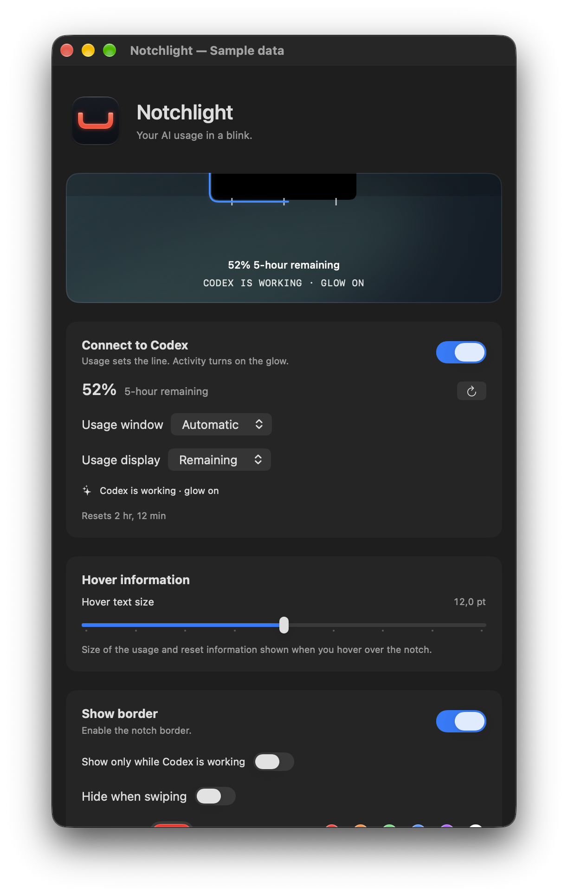
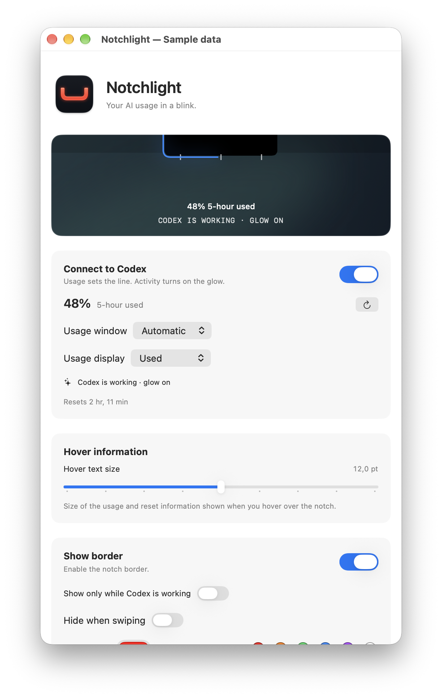
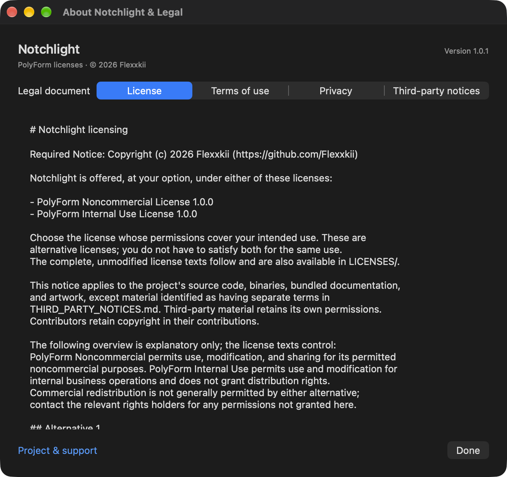

# Notchlight

**Your AI usage in a blink.**

Notchlight is a native macOS utility that turns your MacBook's notch into a
customizable status light. See your Codex usage at a glance, follow its activity,
or simply give your notch a border in a color you like.

[Download the latest release](https://github.com/Flexxkii/notchlight/releases/latest)
· [Usage guide](docs/usage.md)
· [License](LICENSE)
· [Privacy](PRIVACY.md)



## What it does

- **Usage around the notch.** Connect your existing Codex installation to show
  the percentage of your five-hour or weekly allowance used or remaining.
  Choose **Usage display → Remaining** in Settings to show what's left.
- **Activity you can see.** A configurable working color and gentle glow mark
  local Codex activity. Optionally hide the border when idle, with a timeout.
- **Details on hover.** Hover for the usage percentage and reset date; click the
  border to open its native menu.
- **Make it yours.** Adjust start/end percentages, color, line weight, spacing,
  glow, ruler ticks, and hover appearance. Changes apply immediately.
- **Native behavior.** Automatic notch geometry, support for multiple notched
  displays, resizable settings, system appearance, and Reduce Motion support.
- **Local diagnostics.** Inspect or export CPU, memory, and activity measurements
  without an automatic upload.

The app is independent of Apple and OpenAI. Codex is optional: manual border
controls work without a Codex account. The Codex integration uses your installed
CLI and existing sign-in; it does not include a subscription or extra usage.

## Download and install

1. Open [Releases](https://github.com/Flexxkii/notchlight/releases).
2. Download `Notchlight-1.0.3-macOS-arm64.zip`, then unzip it.
3. Move `Notchlight.app` to Applications and open it.
4. Adjust the border, or enable **Connect to Codex** if Codex is installed and
   signed in on your Mac.

**Current release:** the downloadable build is for **Apple Silicon** and is
**ad-hoc signed, not Developer ID signed or notarized**. macOS may block the
first launch. If you trust the download, try opening it, then use **System
Settings → Privacy & Security → Open Anyway**, following
[Apple's instructions](https://support.apple.com/en-us/102445). Managed Macs
may not permit an override. You do not need to disable Gatekeeper globally.

`SHA256SUMS.txt` accompanies the release. To verify the downloaded archive, place
both files in the same folder and run `shasum -a 256 -c SHA256SUMS.txt` there.

The repository and its releases are public.

## Requirements and compatibility

| | Requirement |
| --- | --- |
| Operating system | macOS 14 or later |
| Visible notch border | A supported notched MacBook display |
| Published 1.0.3 build | Apple Silicon (`arm64`) |
| Optional Codex features | Installed Codex CLI/desktop app and an existing compatible sign-in |
| Building from source | Full Xcode 26+ with Swift 6.2+ and Icon Composer asset compilation |

The minimum deployment target is macOS 14, but this release was built and checked
on macOS 27 with Xcode 27. Runtime behavior on macOS 14 and 26 has not been
verified. Intel builds are not included or tested.

Account usage normally refreshes once per minute; local activity is checked
approximately every two seconds. Missing usage is shown as unavailable, not 0%.
Local Codex formats can change, and remote-only activity may not be detected.
Use Codex itself as the authority for billing, limits, and task completion.

**Hide when swiping** is optional and requests Input Monitoring only after you
press Allow. It observes undocumented gesture fields, so an OS update may affect
it. The public desktop-transition fallback works without that permission. The
current app is distributed directly and has not been approved for the Mac App
Store; a store edition would require further compatibility work.

## Build from source

Clone the repository and select your full Xcode installation. For a private
repository, your GitHub account must have access.

```sh
git clone https://github.com/Flexxkii/notchlight.git
cd notchlight
swift test
./scripts/build-app.sh
```

The app is written in Swift 6 using SwiftUI and AppKit. There are no external
Swift package dependencies. The script builds a Release executable, compiles
the Icon Composer asset, bundles the legal documents, verifies them, and signs
the result locally. It creates `build/Notchlight.app`; it does not install it.

```sh
# Build and launch the packaged app:
./scripts/build-app.sh --open

# Run directly while developing (the packaged app has the correct app icon):
swift run Notchlight

# Rebuild and produce the ZIP and SHA-256 file in dist/:
./scripts/package-release.sh
```

Builds target the build machine's architecture. To use your own distribution
certificate, set `NOTCHLIGHT_SIGNING_IDENTITY` when building; that enables
Hardened Runtime and a signing timestamp. Signing alone does not notarize the
app. Notarization and ticket stapling are separate distribution steps.

The editable shipping icon is `Resources/Notchlight.icon`. Open it in Icon
Composer, make your changes, and rebuild. Root legal documents are canonical;
run `./scripts/sync-legal.sh` after editing them to refresh the SwiftPM copies.

## Screenshots

The settings screenshots use the real app views with sample usage data in an
isolated fixture. They show the in-window notch preview, not a photographed
physical camera notch. Your appearance and values will follow your settings.
The legal screenshot is captured from the packaged release app. All three
screenshots were captured on macOS 27.

| Light appearance | License, terms, and privacy |
| --- | --- |
|  |  |

## Privacy and diagnostics

Settings and performance logs stay on your Mac. There is no maintainer-operated
backend or automatic analytics upload. Codex's CLI may contact OpenAI using your
existing account. The optional activity reader examines local Codex session
files to extract lifecycle metadata; it does not retain conversation text.

Diagnostics are enabled by default and can be disabled in Settings. They rotate
while recording with a target retention of 24 hours or 50 MiB. Exporting saves a
ZIP you choose and does not upload it. See the full [privacy policy](PRIVACY.md)
for access, retention, deletion, and permission details, and the
[usage guide](docs/usage.md) for diagnostic workflows.

## License and contributions

Notchlight is offered under your choice of two **unmodified standard licenses**:

| License | Permitted purposes |
| --- | --- |
| [PolyForm Noncommercial 1.0.0](LICENSES/PolyForm-Noncommercial-1.0.0.txt) | Use, modification, and sharing for the license's permitted noncommercial purposes. |
| [PolyForm Internal Use 1.0.0](LICENSES/PolyForm-Internal-Use-1.0.0.txt) | Use and modification for your or your company's internal business operations; no distribution rights. |

This means you can use Notchlight personally for a permitted noncommercial
purpose or internally at work. Noncommercial forks and sharing are permitted
under the Noncommercial alternative. Neither alternative grants a general right
to sell copies or paid forks. Distributing something free of charge does not
necessarily make its purpose noncommercial.

These are alternative licenses: choose the one that covers your intended use.
The [full license texts and project notice](LICENSE) control over this summary.
Notchlight is **source-available**, not OSI-approved open source. Third-party
material retains its independent permissions in [third-party notices](THIRD_PARTY_NOTICES.md).

Also read the [terms of use](TERMS.md), [privacy policy](PRIVACY.md), and
[contribution terms](CONTRIBUTING.md). Contributors retain copyright and offer
accepted contributions under both licenses so recipients have the same choice.
Future terms do not retroactively revoke permissions already granted.

The app includes all four legal documents offline under **Settings → License &
terms**, with an additional **About Notchlight & Legal…** application-menu item.

## Support

Report bugs or ask licensing questions through
[GitHub Issues](https://github.com/Flexxkii/notchlight/issues). Include your macOS
version, app version, and steps to reproduce. Review diagnostics before sharing
and never upload authentication files or conversation content.

Created by [Flexxkii](https://github.com/Flexxkii).
