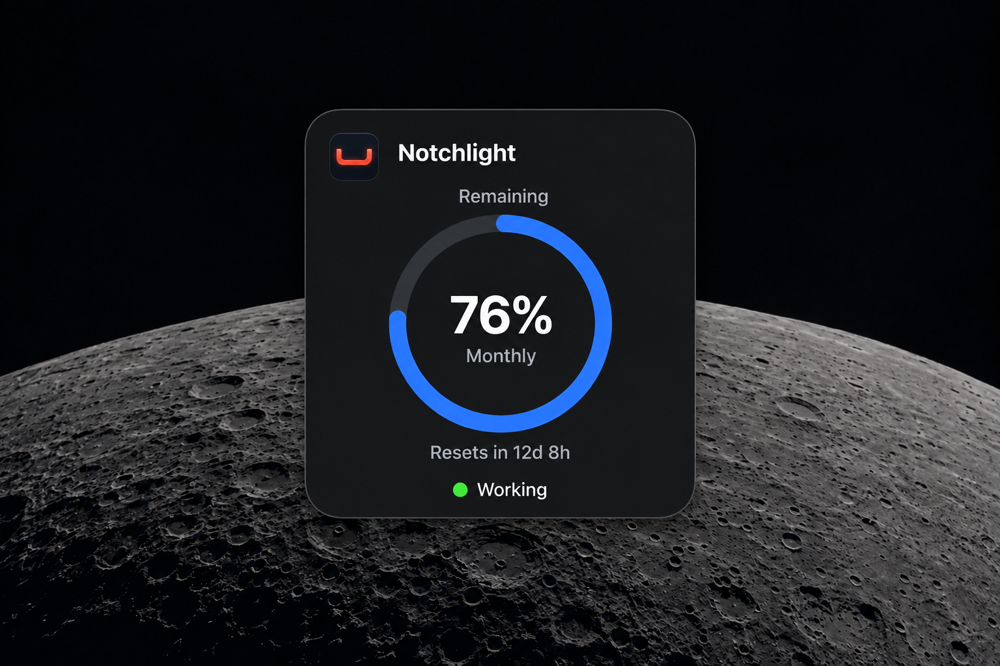
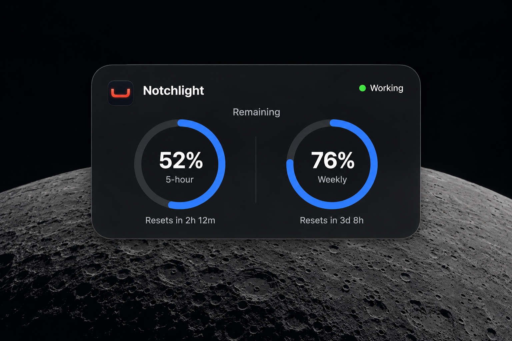

# Notchlight desktop widgets — build handoff

Prepared 18 September 2026. This folder preserves the two selected visual references and the original implementation brief. The implemented feature is documented in [the widget notes](../widgets.md) and ships in [1.2.0](../releases/1.2.0.md).

## Goal and selected designs

Build native macOS desktop widgets for Notchlight using the selected circular-ring design in two sizes:

| Variant | Intended layout | Reference |
| --- | --- | --- |
| Small square | One allowance ring; the selected example shows a monthly allowance. | [square-monthly.png](square-monthly.png) |
| Medium dual | Two allowance rings side by side; the selected example shows five-hour and weekly allowances. | [dual-limits.png](dual-limits.png) |

The user selected the earlier dual-ring mockup and requested a matching square version because their intended Pro-plan use case has a monthly limit without a five-hour limit. Treat this as the requested product scenario, not a verified universal statement about plan entitlements. Use actual available account data rather than hardcoding a layout from a subscription name.

These two images are the selected direction. Earlier U-shaped-gauge and controls mockups elsewhere in the repository are not part of this implementation brief.

### Small square



- Small Notchlight icon and app name across the top.
- Muted heading: **Remaining**.
- One centered circular progress ring, beginning at twelve o'clock and filling clockwise.
- A large percentage in the center, with the allowance name underneath: **Monthly** in this example.
- Reset countdown below the ring.
- A small status dot and the word **Working** at the bottom when activity is available and current.

Illustrative values in the image: **76%**, **Monthly**, **Resets in 12d 8h**, **Working**. None are live data or production defaults.

### Medium dual



- Small Notchlight icon and app name at top left; activity dot and **Working** at top right.
- Muted **Remaining** heading above the pair of rings.
- Two equally weighted rings with large percentages and allowance names inside.
- A subtle vertical separator between the two groups.
- An individual reset countdown below each ring.

Illustrative values in the image: **52% / 5-hour / Resets in 2h 12m**, and **76% / Weekly / Resets in 3d 8h**. These are sample values only.

## Visual requirements

Preserve the approved design's calm, native appearance: dark charcoal surface, restrained perimeter, continuous rounded corners, white primary text, readable gray secondary text, blue rings with muted unfilled tracks, and rounded ring endpoints. Reuse the existing Notchlight app identity and icon assets. Green indicates working activity and is always accompanied by a text label.

The moon is desktop wallpaper in the mockups, not artwork to embed in the widget. The supplied PNGs are enlarged design references, not exact widget dimensions or images to render as the widget UI. Implement the rings, labels, materials, and layout as native views, and check readability at real small and medium widget sizes. Scale the branding down as needed to keep allowance data primary.

Use system typography and widget layout conventions. The dark treatment is the selected visual reference; support system appearance, accessibility contrast and transparency preferences, and any relevant system widget rendering modes available on the supported OS. Keep the rings static; no continuous pulse is needed. Do not add custom glass layers, charts, promotional copy, account-plan badges, border toggles, or Settings buttons to these selected designs.

## Data and display behavior

### Allowances

1. Source data from the existing Codex integration. Do not introduce another login flow or a separate widget-side Codex process.
2. Render the allowances that the account actually exposes. A single monthly allowance must work without a five-hour value.
3. Small widget: prefer the available monthly allowance for the requested monthly-only scenario. If multiple allowances exist, use the app's selected available window; otherwise use a deterministic available-window fallback. Never show an absent monthly window as zero.
4. Medium widget: show the two available windows, preserving the five-hour/weekly pairing when that is what the account exposes. If only one window exists, show one centered ring in the medium widget; do not duplicate it or invent a second limit. Family size remains the user's widget choice.
5. Monthly identification must come from verified integration data or a documented, tested mapping. Do not relabel Weekly as Monthly or assume every month is thirty days. Preserve meaningful distinctions between calendar-month and rolling-duration limits when the source exposes them.
6. Match the mockups by displaying **Remaining**: clamp valid used percentage to 0–100 and calculate `remaining = 100 - used`. The ring and displayed number must represent the same value. Reuse existing formatting where practical. Leave the existing app-wide Used/Remaining preference and its default unchanged.
7. A real zero is valid; absent, malformed, or non-finite data is unavailable. Do not manufacture a percentage from missing data.
8. Derive reset text from the actual reset timestamp. Use concise localized units, handle missing timestamps explicitly, and refresh expired data without inventing a new reset date or a restored allowance.

### Activity and freshness

Show **Working** only when activity is available and sufficiently current. Represent known idle status as **Idle**. When freshness or activity availability cannot be established, use a neutral unavailable/stale state instead of asserting that work is active or idle. Choose and document a freshness policy appropriate to widget refresh behavior; a cached working flag must not remain authoritative indefinitely.

Keep a last-successful snapshot for transient failures, paired with a visible stale indication or last-updated context. Distinguish disconnected, sign-in-required, loading, unavailable, and stale states. Never replace a failed fetch with 0%. Prevent old account values from remaining visible after an intentional disconnect or account change.

### Interaction

These are glanceable usage widgets. Clicking a widget should open or reveal Notchlight's existing settings/usage UI. Do not introduce inline controls or claim real-time task status. Verify the supported native opening/deep-link mechanism during implementation.

## Repository findings to carry into implementation

These findings were checked against the repository during this handoff; inspect the current files again before editing if the code has changed.

| File | Relevant current behavior |
| --- | --- |
| `Package.swift` | Swift tools 6.2, Swift 6 language mode, macOS 14 deployment target; SwiftPM executable and library/test targets, with no widget target listed. |
| `Sources/CodexIntegration/CodexUsage.swift` | `CodexUsageWindow` supports Automatic, 5-hour and Weekly. `CodexUsageValue` carries used percentage, window duration and optional reset date. **The parser currently rejects durations other than 300 and 10,080 minutes**, so monthly support needs a real data-model/parser change. |
| `Sources/Notchlight/App/CodexUsageDisplay.swift` | Existing Used/Remaining conversion, percentage formatting and summaries. |
| `Sources/Notchlight/App/CodexMonitor.swift` | Host app refreshes usage on a 60-second loop, observes activity, and preserves last-known usage on many transient failures. This does not establish a 60-second widget refresh guarantee. |
| `Sources/Notchlight/App/BorderModel.swift` | Existing preferences and integration state. Preserve their meanings and migration behavior. |
| `Sources/Notchlight/App/NotchHoverPresentation.swift` | Existing presentation of unavailable usage, reset information and last-known data. |
| `scripts/build-app.sh` | Packages the SwiftPM executable, icon and resources, then signs the app. Widget embedding and any shared-container configuration are additional work. |
| `Resources/Notchlight.icon` | Existing editable app icon source. Reuse the app's identity. |

The parser restriction is a functional gap, not a copy change. First inspect the actual relevant Codex response/schema and available account data without exposing credentials or conversation content. If the requested monthly data is absent from the integration, report that specific limitation and render an honest unavailable state; do not fabricate support.

## Suggested implementation approach

- Build a native WidgetKit extension with small and medium families, using shared presentation components for the rings and labels. Verify API availability against the installed SDK and the macOS 14 baseline.
- Keep the host app responsible for Codex access. Share a minimal, versioned snapshot with the extension through a supported mechanism verified for this project's signing/distribution configuration. Include allowance values, reset dates, sample time, connection/error state and activity freshness. Do not share credentials, conversation content or raw session files.
- Inspect the existing build and signing setup before choosing the smallest additive project/target changes needed to build, embed and sign the extension. Preserve working SwiftPM library/tests and packaging workflows; document any necessary new build entry point.
- Use platform-appropriate timeline updates and targeted reloads following meaningful host snapshot changes. Verify refresh constraints instead of promising per-second or per-minute widget updates. Avoid duplicate polling loops or permanent animation timers.
- Keep UI state on the main actor and parsing/persistence work appropriately isolated. Preserve the existing overlay, hover, menus, shortcuts, settings and diagnostics.
- For any shared storage or signing requirement that cannot be completed with the current environment, identify the concrete remaining setup. Do not call a rendered preview a working installed widget.

These are implementation recommendations to validate, not APIs or capabilities already implemented in the repository.

## Project constraints and validation

Read `AGENTS.md`, use the installed `macos-native-quality` skill, and read `docs/macos-26-codex-reference-pack.md` and `docs/macos-design-notes.md` before relevant implementation. The reference pack contains historical prompts; it is reference material, not authorization to run an unrelated audit or raise the deployment target. Follow the project's one-agent rule.

Preserve macOS 14, Swift 6, the SwiftUI/AppKit architecture, existing features and unrelated changes. Guard newer APIs and distinguish the installed SDK from the minimum supported OS. Keep project-specific findings in the repository.

Acceptance checks for the build task:

- Both small and medium widgets are discoverable, addable and usable as real macOS widgets in the packaged app.
- The small monthly view matches the selected reference; the medium dual view matches its selected reference at actual widget sizes.
- A monthly-only fixture works without a five-hour window. A two-window fixture shows both values; a one-window medium fixture has no phantom second allowance.
- Meaningful tests cover parser/selection behavior, percentage boundaries, missing or invalid data, reset timestamps, freshness, disconnect/account changes, and shared snapshot serialization where introduced.
- Loading, disconnected, unavailable, stale, idle and working states remain readable and truthful.
- Clicking the widget opens the intended existing app UI.
- VoiceOver exposes each allowance's name, percentage meaning, reset information and status. Color is not the only status cue.
- Visually inspect both sizes in relevant light/dark and accessibility appearances. Verify reduced-motion behavior and text fit.
- Run `swift test`, the relevant widget build checks, and the packaged-app build (currently `./scripts/build-app.sh`, updated if necessary). Check extension embedding/signing and actual widget registration.
- Report only checks actually performed. Identify untested OS versions or any installation/signing constraint explicitly. Do not claim performance gains without measurements.

## Prompt to start the next task

```text
Implement the Notchlight desktop widgets described in
docs/widget-handoff/WIDGET-BRIEF.md. Use the two PNGs in that folder as the
selected design references: a square single-allowance widget and a medium
dual-allowance widget with matching circular progress rings.

Read the brief and project instructions first. Support the monthly-only
scenario using real available Codex data; the current parser accepts only
five-hour and weekly durations, so investigate and fix that limitation
without inventing account limits. Preserve the existing app architecture,
macOS 14 target, Swift 6 mode, features and unrelated changes. Work as one
agent. Implement, package and verify the native widgets, and report any
concrete platform or data-source blocker and checks not performed.
```
